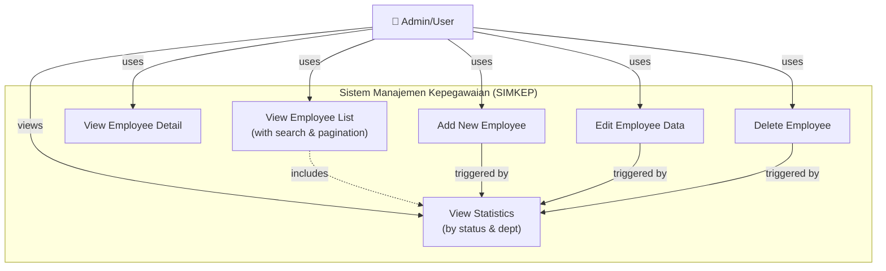
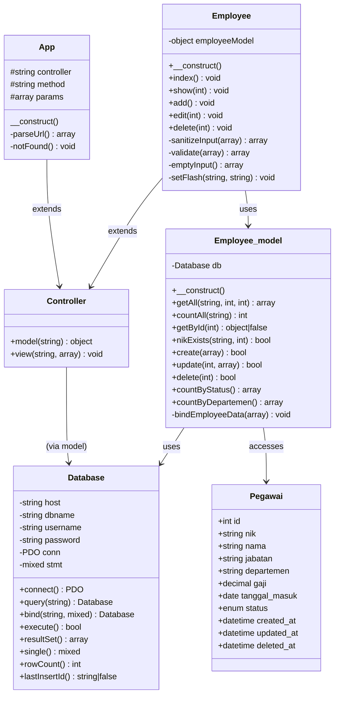
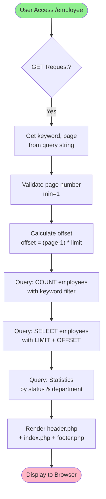
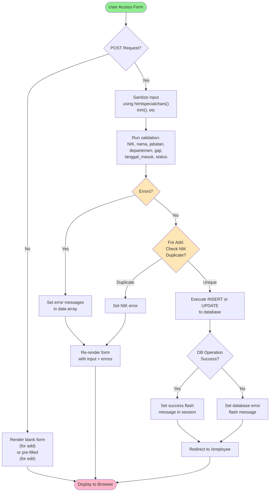
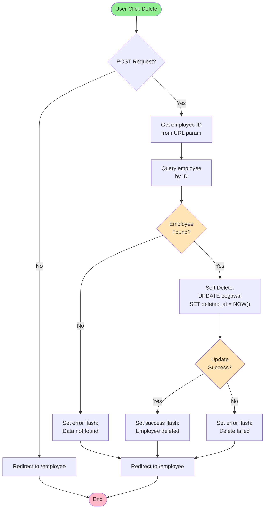
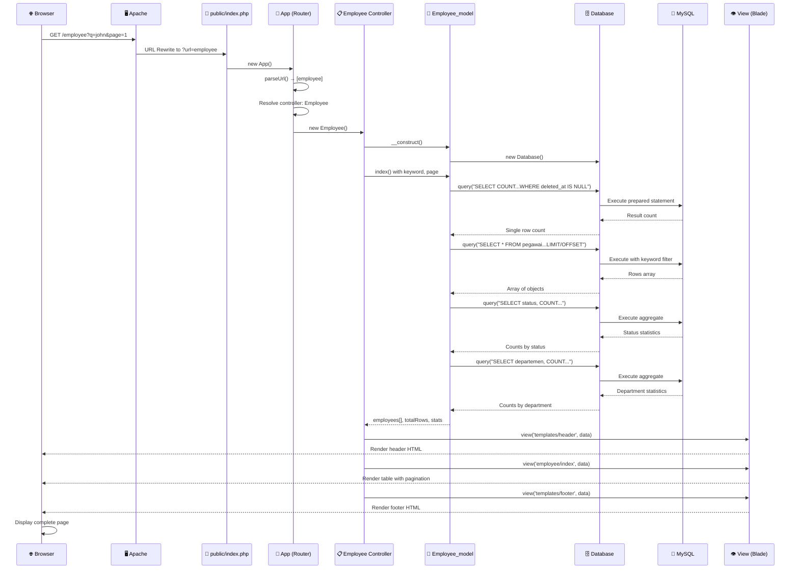
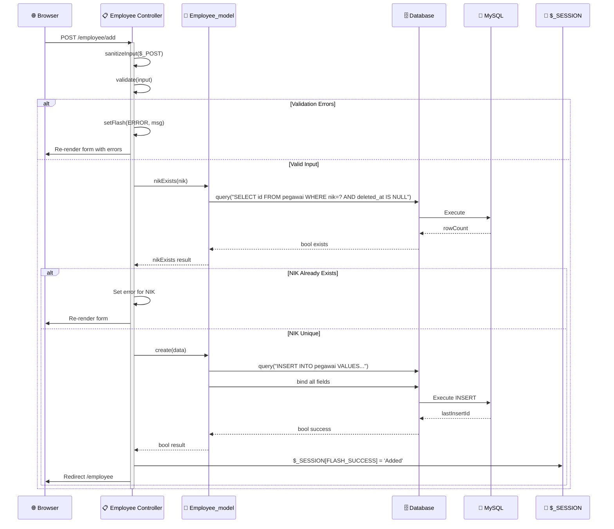
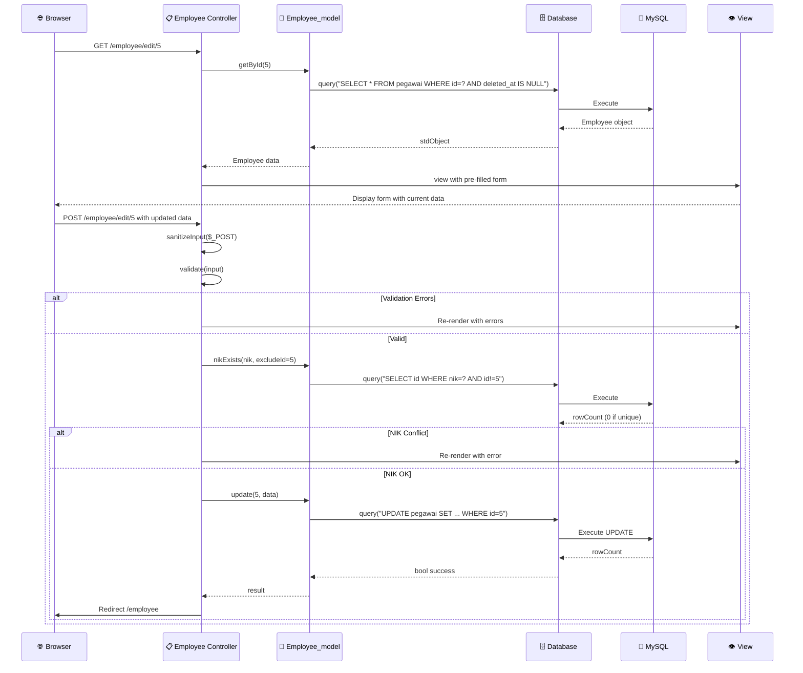
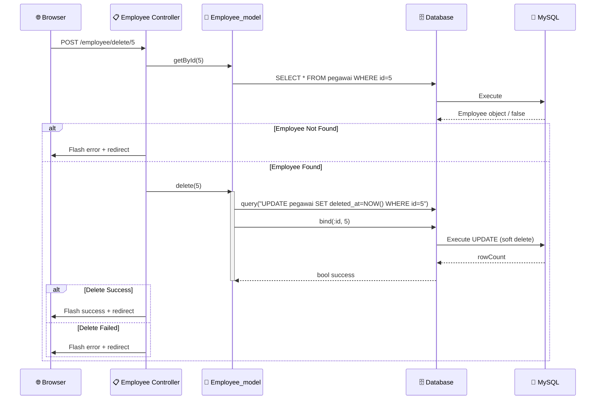

# Arsitektur Aplikasi SIMKEP

## Pola Desain: MVC (Model–View–Controller)

Aplikasi ini mengimplementasikan pola MVC secara **murni tanpa framework**, menggunakan PHP 8.x native dengan PDO untuk akses database.

---

## Struktur Direktori

```
mvc-kepegawaian/
├── app/
│   ├── config/
│   │   └── config.php           # Konstanta, konfigurasi DB & app
│   ├── controllers/
│   │   └── Employee.php         # Controller utama CRUD pegawai
│   ├── core/
│   │   ├── App.php              # Router / Front Controller
│   │   ├── Controller.php       # Base Controller (model + view loader)
│   │   ├── Database.php         # PDO wrapper
│   │   └── helpers.php          # Fungsi utilitas global
│   ├── models/
│   │   └── Employee_model.php   # Model akses data pegawai
│   └── views/
│       ├── employee/
│       │   ├── index.php        # Daftar pegawai + statistik
│       │   ├── add.php          # Form tambah pegawai
│       │   ├── edit.php         # Form edit pegawai
│       │   └── show.php         # Detail pegawai
│       └── templates/
│           ├── header.php       # Layout atas + sidebar + CSS
│           ├── footer.php       # Layout bawah + JS
│           └── 404.php          # Halaman not found
├── database/
│   └── kepegawaian.sql          # Skema + data awal
├── docs/
│   └── ARCHITECTURE.md          # Dokumen ini
├── public/
│   ├── .htaccess                # URL rewriting Apache
│   └── index.php                # Entry point aplikasi
└── README.md
```

---

## Database

### Tabel: `pegawai`

| Kolom           | Tipe               | Keterangan               |
| --------------- | ------------------ | ------------------------ |
| `id`            | INT UNSIGNED PK    | Auto increment           |
| `nik`           | VARCHAR(18) UNIQUE | Nomor Induk Karyawan     |
| `nama`          | VARCHAR(100)       | Nama lengkap             |
| `jabatan`       | VARCHAR(100)       | Posisi/jabatan           |
| `departemen`    | VARCHAR(50)        | Unit kerja               |
| `gaji`          | DECIMAL(15,0)      | Gaji bulanan             |
| `tanggal_masuk` | DATE               | Tanggal bergabung        |
| `status`        | ENUM               | Aktif / Non-Aktif / Cuti |
| `created_at`    | DATETIME           | Timestamp buat           |
| `updated_at`    | DATETIME           | Timestamp ubah           |
| `deleted_at`    | DATETIME           | Soft delete              |

---

## Fitur Keamanan

- **Prepared Statements** — Semua query menggunakan PDO prepared statements, mencegah SQL Injection
- **XSS Prevention** — Output di-escape dengan `htmlspecialchars()`
- **Input Sanitization** — Semua input POST di-sanitasi sebelum diproses
- **CSRF-lite** — Form delete menggunakan method POST
- **Soft Delete** — Data tidak benar-benar dihapus, hanya ditandai `deleted_at`
- **Input Validation** — Server-side validation di controller sebelum ke model

---

## UML Diagrams

### 1. Use Case Diagram



### 2. Class Diagram



### 3. Activity Flowchart

#### 3.1 List & Search Employee Flow



#### 3.2 Add/Edit Employee Flow



#### 3.3 Delete Employee Flow



### 4. Sequence Diagram

#### 4.1 Sequence: View Employee List



#### 4.2 Sequence: Add New Employee



#### 4.3 Sequence: Edit Employee



#### 4.4 Sequence: Delete Employee



---

## Tim Pengembang

| Nama                         | NIM       | Peran                 |
| ---------------------------- | --------- | --------------------- |
| Al Nizar Baihaqi             | 202331181 | Arsitektur & Core MVC |
| Aulia Ramadhana              | 202331061 | Model & Database      |
| Rafi Indra Pramudhito Zuhayr | 202331291 | Views & Frontend      |

_Kelompok 14 — Implementasi MVC pada Aplikasi Manajemen Kepegawaian_
